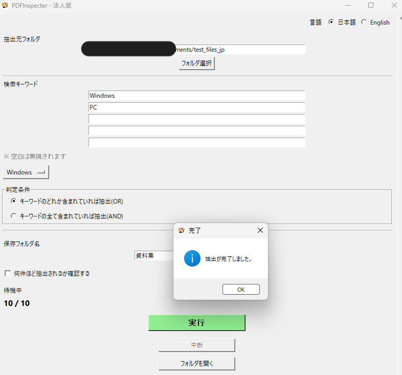
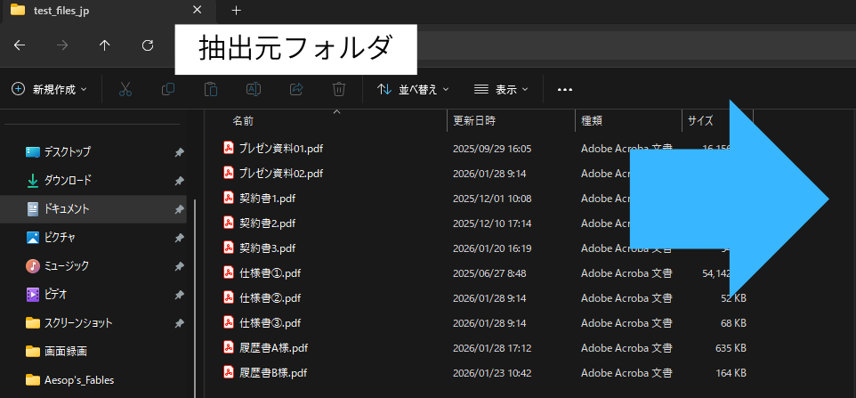
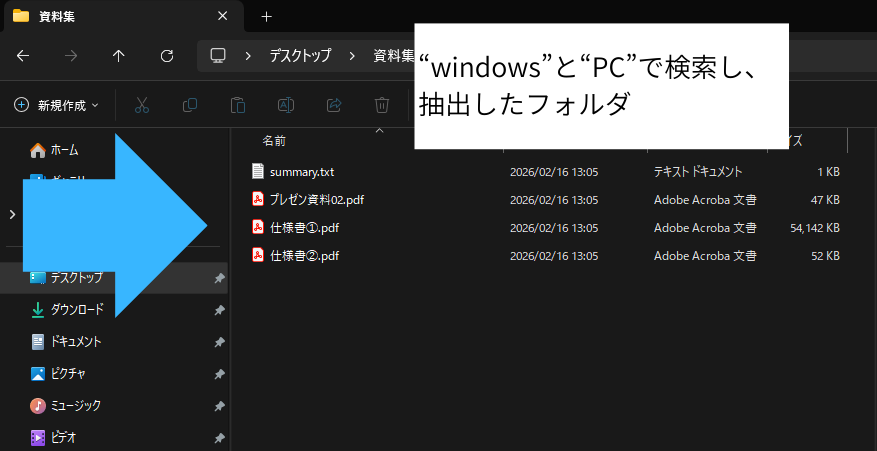

# PDF Inspector Business
*(Bulk PDF Keyword Search Tool for Windows)*

---

## 🚨 重要なお知らせ / Important Notice

**PDF Inspector Business は法務文書や契約書の正確な全文比較ツールではありません。**  
本ソフトは、人の目視確認が必要なPDFを**効率的に絞り込む業務支援ツール**です。  

- 大量のPDF資料を扱う方  
- 契約書・仕様書・報告書などをまとめて確認したい方  
- 目視チェックに時間をかけたくない方  

のために開発されました。  
**「検索→確認→抽出」の時間を大幅に短縮**します。
---

<!-- デモGIF -->

> 「今から何百ものPDFを確認しなきゃ…」  
> 「でも数分で確認すべき書類だけを選定できた！」
---

## ✅ このツールでできること / What You Can Do

- PDFフォルダを丸ごとスキャン（最大300件）  
- 指定キーワードの一括検索（AND / OR対応）  
- 条件に合ったPDFの抽出・整理  
- 確認前に「どれくらいヒットするか」を事前に確認  
- 日本語／English UI切替対応  

> 業務の時間を「確認作業」から「判断・実行」に集中させられます。
---

### 📁 ファイル整理のビフォーアフター

使用前：  

抽出・整理後：  

---
### 🏢 よくある利用シーン

- 月曜の朝、**数百件の契約書PDF**を前に確認作業を始める法務担当者  
- プロジェクト開始前に、**複数社から届いた仕様書PDF**を一気にチェックするPM  
- 監査やレビュー前に、**特定キーワードを含む資料だけ**を素早く抽出したい管理部門  

PDF Inspector Businessは、  
「全部読む」作業を  
**「読むべきものだけを選ぶ」作業**に変えます。
---

## 📂 対応PDF・注意点 / Supported PDF Types & Notes

### 対応PDF

- PC作成のテキストベースPDF  
- 選択・コピー可能な横書き文書（日本語／英語）  

### 注意が必要なPDF

- 縦書きや手書き文字入りPDF  
- 画像スキャンのみのPDF  
- 小さすぎる文字や不鮮明なPDF  

> テキストが少ない場合はOCR補助を実行しますが、**完全認識は保証できません**。

---

## ⚡ 主な機能 / Key Features

| 機能 | 説明 |
|------|------|
| 一括PDF解析 | 最大300件までフォルダ内PDFを一括読み込み |
| キーワード検索 | AND / OR条件で複数語検索（最大5語） |
| OCR補助 | 文字認識が難しいページに自動OCR |
| 事前確認モード | 抽出前にヒット件数を確認可能 |
| 抽出・整理 | 検索結果PDFを指定フォルダへ出力 |
| 実行ログ | 自動保存され、作業履歴を管理 |
| 多言語UI | 日本語／English切替対応 |

---

## 🖥️ 動作環境 / System Requirements

- Windows 10 / 11  
- 標準的なPC（管理者権限不要）  
- フォルダ直下PDFのみ対象（サブフォルダは非対応）  

---

## 🏃 使い方 / How to Use

1. PDF Inspector Business（exe）を起動  
2. PDFフォルダを選択（最大300件、推奨100件以内）  
3. 検索キーワードを入力（最大5語）  
4. AND / OR を選択  
5. **事前確認モード**を選ぶか実行  
6. 実行ボタンで処理開始  

> Preview Mode（dry-run）で件数確認後に実行すると安心です。

---

## 🔒 データ取り扱い / Data Handling & Privacy

- 完全オフラインで動作  
- PDFファイル・抽出結果・ログはすべてPC内のみ  
- 外部サーバーや第三者への送信なし  

> 機密文書でも安心して利用可能です。

---

## 💳 ライセンス / License

- **1PCにつき1ライセンス**  
- 複数PCで使用する場合は追加購入必要  
- **買い切り型ソフトウェア**（期限なし）  

---

## 💳 ご購入について

- 参考価格：**約27,800円**（Stripe決済にて安全に購入可能）
- ご購入は以下のリンクから行えます：
[購入ページ / Stripe Payment]→購入リンクを準備中です。ご購入の際はお手数ですがメールをお送りください。(swlinkalt@gmail.com)

> ※ 実際の決済金額はStripe上で確定します。為替や手数料の影響により、若干の変動がある場合があります。

---

## 🔄 アップデート・サポート / Updates & Support

### 初年度

- 購入時に初年度のアップデート・サポート費用込み  
- 機能改善、バグ修正、Windows更新対応

### 2年目以降

- 任意でアップデート・サポートを更新  
- 更新しなくても購入済バージョンは使用可能

### 更新ルール（重要）

- 更新期限から1年未満 → 通常更新扱い  
- 更新期限から1年以上 → 再加入扱い（手数料発生可能）  

> 継続利用者が不利にならないルールです。

---

## ⚠️ 動作保証 / Disclaimer

- 開発時のWindows環境で確認済  
- 将来のOSアップデートで一部機能に影響が出る可能性あり  
- 全環境での完全保証はありません  

---

## 📥 再ダウンロード / Re-download

- 誤削除やPC買い替え時は購入履歴確認後に案内  
- 提供バージョンは購入時点またはサポート期間内の最新版  

---

## 📩 問い合わせ / Contact

**swlinkalt@gmail.com**  

---

💡 **ポイントまとめ**  
- 目視確認作業を最大50〜70％削減可能  
- 大量PDFのチェックが「一括・高速・安心」  
- 法務・営業・管理部門すべてに最適
